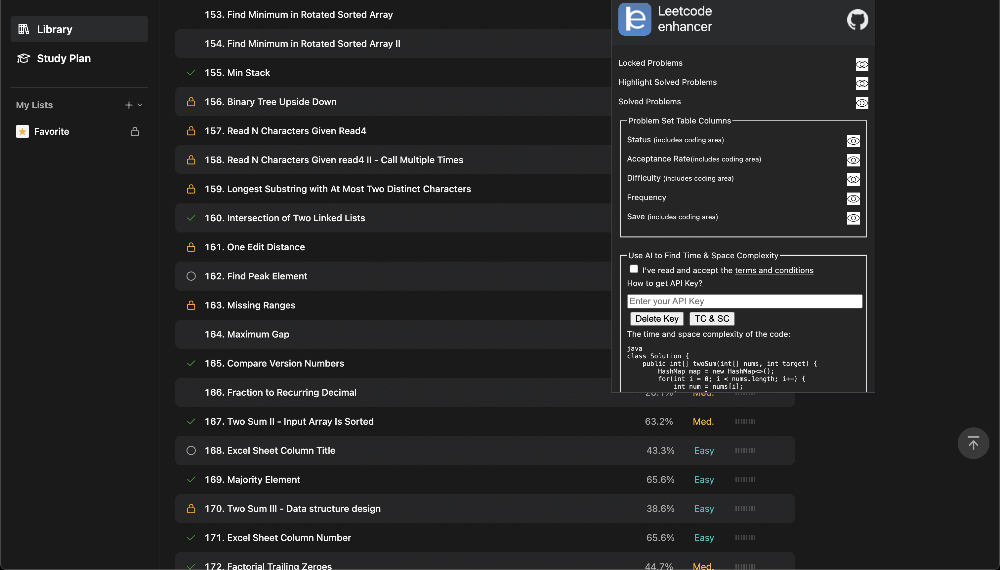
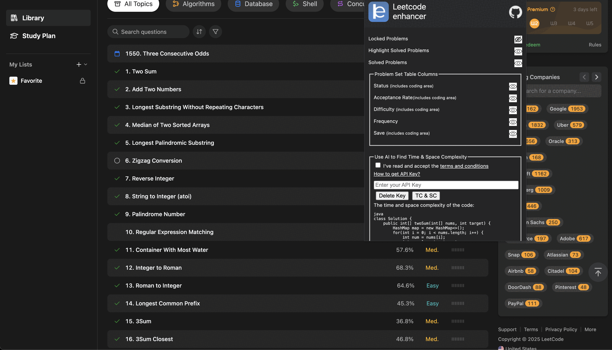

<hr>


**A cross-browser extension to improve :rocket: productivity on 
<a href="https://leetcode.com" target="_blank">Leetcode</a>**.

It is a light-weight browser extension which can be pinned in menu bar. It boosts your productivity by hiding unnecessary visual elements from the screen, enabling you to focus on what is important. You can change your preferences form the popup menu and find out what best suits your needs.

<div align="center">
    
    <br>
    
    <br>
    
</div>

## :heavy_check_mark: Features
* Hide Difficulty
* Hide Locked Problems
* Highlight Solved Problems
* Hide Solved Problems
* Hide / Show Problems Table Columns (incl. Difficulty, Acceptance etc.)

**Note**: The extension functions on the following URLs :
* https://leetcode.com/problemset/
* https://leetcode.com/problems/*
* https://leetcode.com/contest/

## :star2: Installation
### Google Chrome
* To install this extension from Chrome Web Store <a href="https://chrome.google.com/webstore/detail/leetcode-enhancer/gcmncppaaebldbkgkcbojghpmpjkdlmp" target="_blank">click here</a>.

* After installation, you should pin this extension to use its features.
### Mozilla Firefox
* To install this extension from Firefox Browser Addons <a href="https://addons.mozilla.org/en-US/firefox/addon/leetcode-enhancer/" target="_blank">click here</a>.

### Microsoft Edge
* To install this extension from Microsoft Edge Addons <a href="https://microsoftedge.microsoft.com/addons/detail/leetcode-enhancer/dgddijgkneackjhmijacbopefpladfia" target="_blank">click here</a>.

<div align = "center">
    
</div>

* In case of Mozilla Firefox, the icon will appear in the address bar as this is a page specific extension, this makes sure the extension is running, only when you need it and not all the time.

## :crown: For developers

### 1. Clone the source code locally:

Would really appreciate if you can :star: the repository

```sh
$ git clone https://github.com/loveshdongre/leetcode-enhancer/
$ cd leetcode-enhancer
```

### 2. Building the Extension locally

1. Install Live Sass Compiler (Ritwick Dey) extension on VS code or any other compiler of you choice and make sure before testing the compiler is watching and converting you scss file into css if making any changes in scss file. It is required to convert the file popup.scss to popup.css only.
2. Install browserify globally 
`npm i browserify -g`
3. Once code changes are done run `deployment-zip-maker.sh` file.
    >a. This take content-script-main.js, popup-main.js and service-worker-main.js and convert them to content-script.js, popup.js and service-worker.js respectively.
    
    >b. Creates the `deployment` folder which will be used to load the extension in the browser

### 3. Load Extension in the Browser
#### Google Chrome
* Go to `chrome://extensions/` from url search and enable `Developer mode`
* Click on `load unpacked` and select the folder containing `manifest.json` file
* Pin this extension to use it.

#### Mozilla Firefox
* Go to `about:debugging` from url search and click on `This Firefox` (if you are not already there)
* Click on `Load Temporary Add-on...` and select the `manifest.json` file
* The addon will appear next to the address bar only when you are on leetcode

#### Microsoft Edge
* follow steps in this [link](https://www.windowscentral.com/how-install-non-store-extensions-microsoft-edge)


## :file_folder: File Description
- .github: Hidden directory that contains git template for submitting an issue.
- deployment: It's gets generated when user run file `deployment-zip-maker.sh`. It is used to build browser specific directory for testing and creating zip for deployment in extension app stores.
- docs: Contains terms and condition, Licence and guide to obtain API key of Cohere
- icons: contains app logo, custom checkmark logos, etc
- images: contains display images for web stores
- scripts: this is the main source folder where all the scripts are present. This code is mostly modified for development.
- .babelrc: babel configuration file
- .gitignore: files ignored by git
- content-script.css: for injecting custom style sheet.
- deployment-zip-maker.sh: bash file to create zip file of the only files important for deployment
- manifest.json: Heart of the extension which contains all the configurations. (tip: understand this first)
- popup.css: style sheet for extension pop
- popup.css.map: intermediate file generated while converting .scss file to .css file with Live Sass Compiler extension (Vscode)
- popup.html: html file for extension pop
- popup.js: js file to handle changes like storaging checkbox preferences.
- popup.scss: Scss file for styling popup.html file.
- README.md: Guide for the entire extension
- service-worker.js (background script): One important function is listens event from the content-script and enables extension icon in the browser

## :handshake: Contribution
Contributions are always welcomed, here is what you need to do:
1. Work on an existing issue or create a new one [here](https://github.com/loveshdongre/leetcode-enhancer/issues)
2. Create a pull request linked to that issue

Note: Please set up your [git config](https://git-scm.com/book/en/v2/Customizing-Git-Git-Configuration) for user and email so your name gets updated as a contributor

Know more about [pull request](https://docs.github.com/en/free-pro-team@latest/github/collaborating-with-issues-and-pull-requests/about-pull-requests).

## :pencil: Feedback
In order to add more useful features and keep the extension bug free your feedback is important. It will be really appreciated, if you could take out some time to write a review so that this extension can be improved ASAP.

* Google Chrome users can leave a feedback [here](https://chrome.google.com/webstore/detail/leetcode-enhancer/gcmncppaaebldbkgkcbojghpmpjkdlmp)
* Mozilla Firefox users can leave a feedback [here](https://addons.mozilla.org/en-US/firefox/addon/leetcode-enhancer/)


## :earth_asia: Development Env Tools
* MacOS Sequoia: 15.4.1
* Mozilla Firefox: 138.0.1
* Google Chrome / Brave / Edge: (Chromium) 136.0.7103.93

## :clipboard: License
MIT © <a href = "https://loveshdongre.tech" target="_blank">Lovesh Dongre</a>
