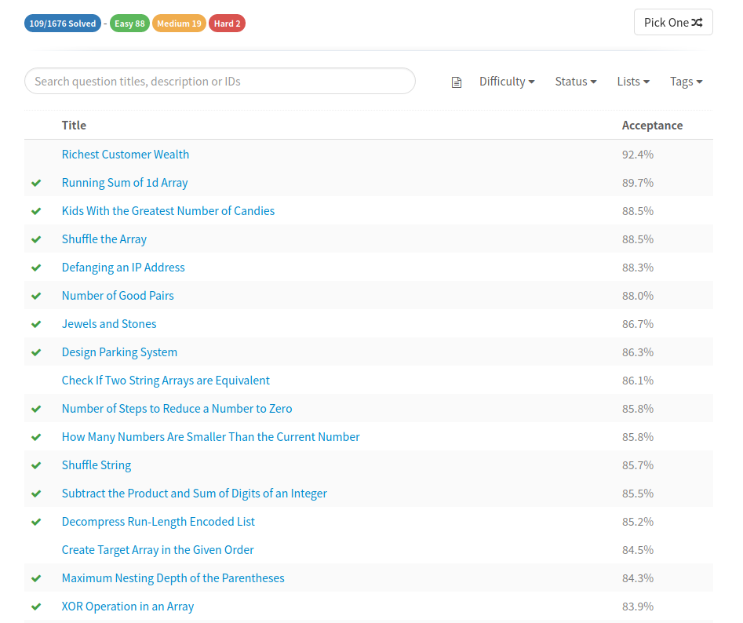
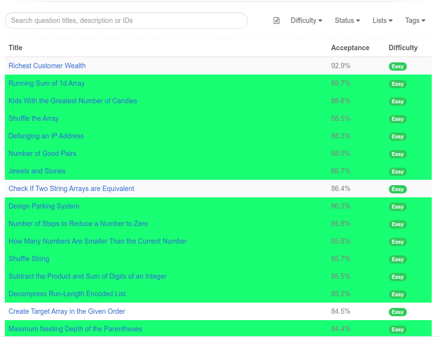

<hr>


**A cross-browser extension to improve :rocket: productivity on 
<a href="https://leetcode.com" target="_blank">Leetcode</a>**.

It is a light-weight browser extension which runs in the menu bar. It boosts your productivity by hiding unnecessary visual elements from the screen, enabling you to focus on what is important. You can change your preferences form the popup menu and find out what best suits your needs.

<div align="center">
    
    <br>
    
    <br>
    
</div>

## :heavy_check_mark: Features
* Hide locked problems from the table
* Highlight solved problems
* Hide Difficulty count
* Hide / Show any table column (except for title column)

**Note**: The extension functions on the following URLs :
* https://leetcode.com/problemset/all/*
* https://leetcode.com/tag/*

## :star2: Installation
### Google Chrome
* To install this extension from Chrome Web Store <a href="https://chrome.google.com/webstore/detail/leetcode-enhancer/gcmncppaaebldbkgkcbojghpmpjkdlmp" target="_blank">click here</a>.

* After installation, you should pin this extension to use its features.
### Mozilla Firefox
* To install this extension from Firefox Browser Addons <a href="https://addons.mozilla.org/en-US/firefox/addon/leetcode-enhancer/" target="_blank">click here</a>.

<div align = "center">
    
</div>

* In case of Mozilla Firefox, the icon will appear in the address bar as this is a page specific extension, this makes sure the extension is running, only when you need it and not all the time.

## :crown: For developers
Clone the source locally:

```sh
$ git clone https://github.com/loveshdongre/leetcode-enhancer/
$ cd leetcode-enhancer
```
### Google Chrome
* Go to `chrome://extensions/` and enable `Developer mode`
* Click on `load unpacked` and select the `manifest.json` file
* Pin this extension to use it.

### Mozilla Firefox
* Go to `about:debugging` and click on `This Firefox` (if you are not already there)
* Click on `Load Temporary Add-on...` and select the `manifest.json` file
* The addon will appear next to the address bar only when you are on leetcode

## :handshake: Contributing
Want to contribute? After running the extension locally, you can create a pull request with your changes and then it can be reviewed for acceptance.

Know more about [pull request](https://docs.github.com/en/free-pro-team@latest/github/collaborating-with-issues-and-pull-requests/about-pull-requests).

## :pencil: Feedback
In order to add more useful features and keep the extension bug free your feedback is important. It will be really appreciated, if you could take out some time to write a review so that this extension can be improved ASAP.

* Google Chrome users can leave a feedback [here](https://chrome.google.com/webstore/detail/leetcode-enhancer/gcmncppaaebldbkgkcbojghpmpjkdlmp)
* Mozilla Firefox users can leave a feedback [here](https://addons.mozilla.org/en-US/firefox/addon/leetcode-enhancer/)


## :earth_asia: Development Env Tools
* Ubuntu 20.04
* Mozilla Firefox 83.0
* Google Chrome 87.0
* Live Sass Compiler (Ritwick Dey)

## :clipboard: License
MIT © <a href = "https://loveshdongre.tech" target="_blank">Lovesh Dongre</a>
