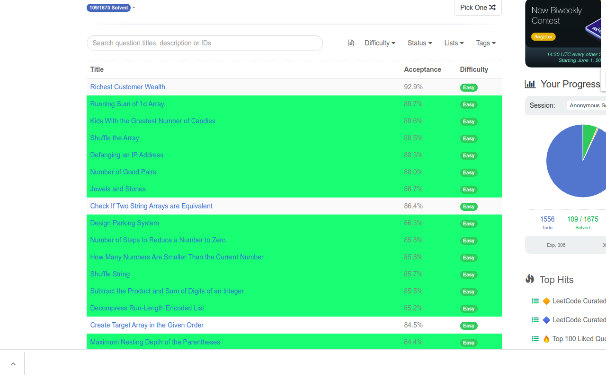

<hr>

 


**A cross-browser extension to improve :rocket: productivity on 
<a href="https://leetcode.com" target="_blank">Leetcode</a>**

It is a light-weight browser extension which runs in the menu bar. It boosts your productivity by hiding unnecessary visual elements from the screen, enabling you to focus on what is required to see. You change your preferences form the UI and find out what best suits your needs.

<div align="center">
    
    <br>
    
</div>

## :heavy_check_mark: Features
:white_check_mark: Hide locked problems from the table

:white_check_mark: Highlight solved problems

:white_check_mark: Hide Difficulty count

:white_check_mark: Hide / Show any table column (except for title column)

**Note**: The extension can be used only on these two types of URLs
* https://leetcode.com/problemset/all/*
* https://leetcode.com/tag/*

## :star2: Installation
* ### Google Chrome
    To install this extension from Chrome Web Store <a href="" target="_blank">click here</a>
    
    After installation you should pin this extension to use its features.
* ### Mozilla Firefox
    To install this extension from Firefox Browser Addons <a href="https://addons.mozilla.org/en-US/firefox/addon/leetcode-enhancer/" target="_blank">click here</a>
    
    After installing this extension the button for it will appear next to the address bar and not where the global extensions are visible. This is done to make sure the extension is running only when you need it.

## :crown: For developers
Clone the source locally:

```sh
$ git clone https://github.com/loveshdongre/leetcode-enhancer/
$ cd leetcode-enhancer
```
* ### Google Chrome
    - Go to `chrome://extensions/` and enable `Developer mode`
    - Click on `load unpacked` and select the `manifest.json` file
    - Pin this extension to use it.

* ### Mozilla Firefox
    - Go to `about:debugging` and click on `This Firefox` (if you are not already there)
    - Click on `Load Temporary Add-on...` and select the `manifest.json` file
    - The addon will appear next to the address bar only when you are on leetcode

## :earth_asia: Development Env
* Ubuntu 20.04
* Mozilla Firefox 83.0
* Google Chrome 87.0
* Live Sass Compiler (Ritwick Dey)

## :clipboard: License
MIT © <a href = "https://loveshdongre.tech" target="_blank">Lovesh Dongre</a>