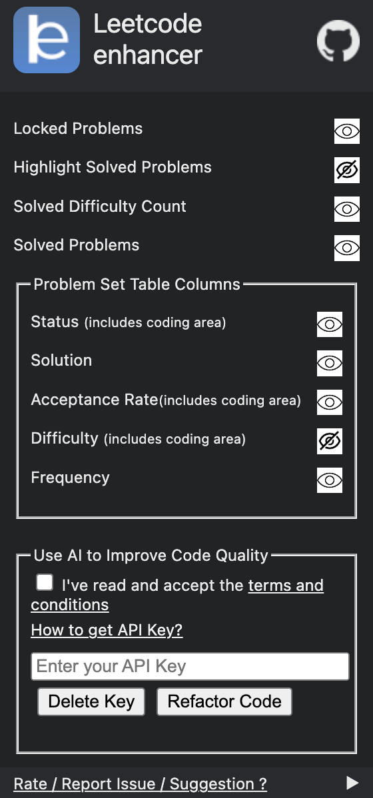
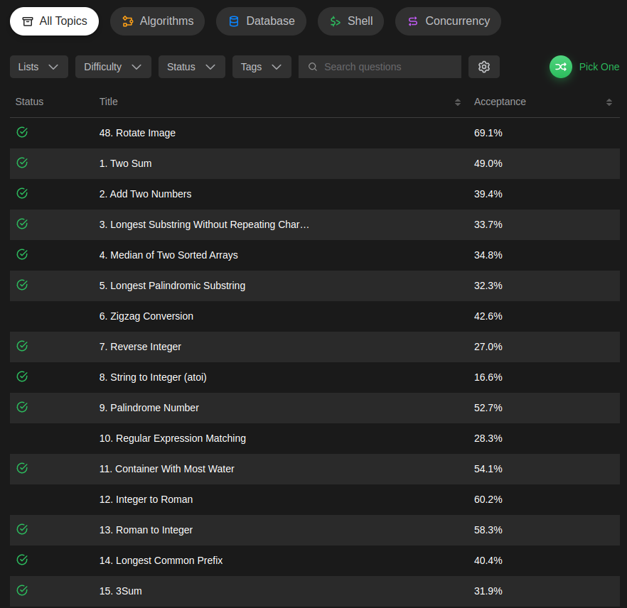
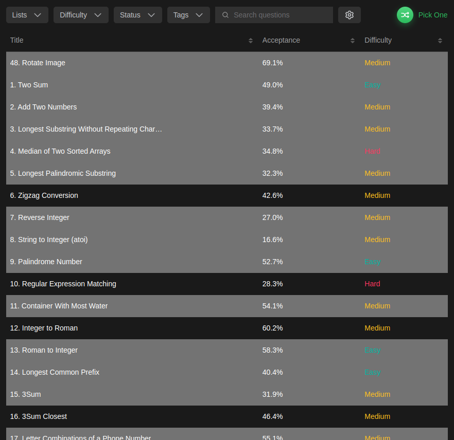

<hr>


**A cross-browser extension to improve :rocket: productivity on 
<a href="https://leetcode.com" target="_blank">Leetcode</a>**.

It is a light-weight browser extension which runs in the menu bar. It boosts your productivity by hiding unnecessary visual elements from the screen, enabling you to focus on what is important. You can change your preferences form the popup menu and find out what best suits your needs.

<div align="center">
    
    <br>
    
    <br>
    
</div>

## :heavy_check_mark: Features
* Hide Locked Problems
* Hide / Show Specific Table Columns (incl. Difficulty, Acceptance etc.)
* Highlight Solved Problems
* Hide Difficulty Count
* Hide Solutions Users' Profile Images

**Note**: The extension functions on the following URLs :
* https://leetcode.com/problemset/all/ (old and new UI)
* https://leetcode.com/tag/
* https://leetcode.com/problems/
* https://leetcode.com/problems/discuss/

## :star2: Installation
### Google Chrome
* To install this extension from Chrome Web Store <a href="https://chrome.google.com/webstore/detail/leetcode-enhancer/gcmncppaaebldbkgkcbojghpmpjkdlmp" target="_blank">click here</a>.

* After installation, you should pin this extension to use its features.
### Mozilla Firefox
* To install this extension from Firefox Browser Addons <a href="https://addons.mozilla.org/en-US/firefox/addon/leetcode-enhancer/" target="_blank">click here</a>.

### Microsoft Edge
* To install this extension from Microsoft Edge Addons <a href="https://microsoftedge.microsoft.com/addons/detail/leetcode-enhancer/dgddijgkneackjhmijacbopefpladfia" target="_blank">click here</a>.

<div align = "center">
    
</div>

* In case of Mozilla Firefox, the icon will appear in the address bar as this is a page specific extension, this makes sure the extension is running, only when you need it and not all the time.

## :crown: For developers
Clone the source code locally:

Would really appreciate if you can :star: the repository

```sh
$ git clone https://github.com/loveshdongre/leetcode-enhancer/
$ cd leetcode-enhancer
```
### Google Chrome
* Go to `chrome://extensions/` and enable `Developer mode`
* Click on `load unpacked` and select the folder containing `manifest.json` file
* Pin this extension to use it.

### Mozilla Firefox
* Go to `about:debugging` and click on `This Firefox` (if you are not already there)
* Click on `Load Temporary Add-on...` and select the `manifest.json` file
* The addon will appear next to the address bar only when you are on leetcode

### Microsoft Edge
* follow steps in this [link](https://www.windowscentral.com/how-install-non-store-extensions-microsoft-edge)

## :file_folder: File Description
- icons: contains app logo, custom checkmark logos, etc
- images: contains display images for web stores (not deployed so don't add images in this folder)
- .gitignore: files ignored by git
- background.js: One important function is listens event from the content-script and enables extensioin icon in the browser
- content-script.css: for injecting custom style sheet.
- LICENSE: MIT License file
- manifest.json: Heart of the extension which contains all the configurations. (tip: understand this first)
- popup.css: style sheet for extension pop
- popup.css.map: intermediate file generated while converting .scss file to .css file with Live Sass Compiler extension (Vscode)
- popup.html: html file for extension pop
- popup.js: js file to handle changes like storaging checkbox preferences.
- README.md: Guide for the entire extension

## :handshake: Contribution
Contributions are always welcomed, here is what you need to do:
1. Work on an existing issue or create a new one [here](https://github.com/loveshdongre/leetcode-enhancer/issues)
2. Create a pull request linked to that issue

Note: Please set up your [git config](https://git-scm.com/book/en/v2/Customizing-Git-Git-Configuration) for user and email so your name gets updated as a contributor

Know more about [pull request](https://docs.github.com/en/free-pro-team@latest/github/collaborating-with-issues-and-pull-requests/about-pull-requests).

## :pencil: Feedback
In order to add more useful features and keep the extension bug free your feedback is important. It will be really appreciated, if you could take out some time to write a review so that this extension can be improved ASAP.

* Google Chrome users can leave a feedback [here](https://chrome.google.com/webstore/detail/leetcode-enhancer/gcmncppaaebldbkgkcbojghpmpjkdlmp)
* Mozilla Firefox users can leave a feedback [here](https://addons.mozilla.org/en-US/firefox/addon/leetcode-enhancer/)


## :earth_asia: Development Env Tools
* Ubuntu 20.04
* Mozilla Firefox 83.0
* Google Chrome 87.0
* Live Sass Compiler (Ritwick Dey)

## :clipboard: License
MIT © <a href = "https://loveshdongre.tech" target="_blank">Lovesh Dongre</a>
