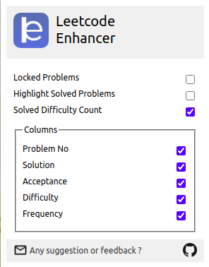

<hr>

 


**A cross-browser extension to improve productivity on [Leetcode](https://leetcode.com)**

It is a light-weight browser extension which runs in menubar. It boosts your productivity by hiding unnecessary visual elements from the screen enabling you to focus on what is important to see. You change your preferences form the UI and find out what best suits your needs.



## Functionalities

- [x] Hide locked problems from the table
- [x] Highlight solved problems
- [x] Hide Difficuly count
- [x] Hide / Show any table column (except for title column)

**Note**: The following functionalities work on these two kinds of URLs
* https://leetcode.com/problemset/all/*
* https://leetcode.com/tag/*

## Installation
* ### Google Chrome
    To install this extension from Chrome Web Store [click here]()
    
    After installation you should pin this extension to use its features.
* ### Mozilla Firefox
    To install this extension from Firefox Browser Addons [click here]()
    
    After installing this extension the button for it will appear next to the address bar and not the where the global extensions are visible. This makes sure the extension is running only when you need it.

## For developers
Clone the source locally:

```sh
$ git clone https://github.com/loveshdongre/leetcode-enhancer/
$ cd leetcode-enhancer
```
* ### Google Chrome
    - Go to `chrome://extensions/` and enable `Developer mode`
    - Click on `load unpacked` and select the `manifest.json` file
    - Pin this extension to use it.

* ### Mozilla Firefox
    - Go to `about:debugging` and click on `This Firefox` (if you are not already there)
    - Click on `Load Temporary Add-on...` and select the `manifest.json` file
    - The addon will appear next to the address bar only when you are on https://leetcode.com
## License
MIT © [Lovesh Dongre](https://loveshdongre.tech)